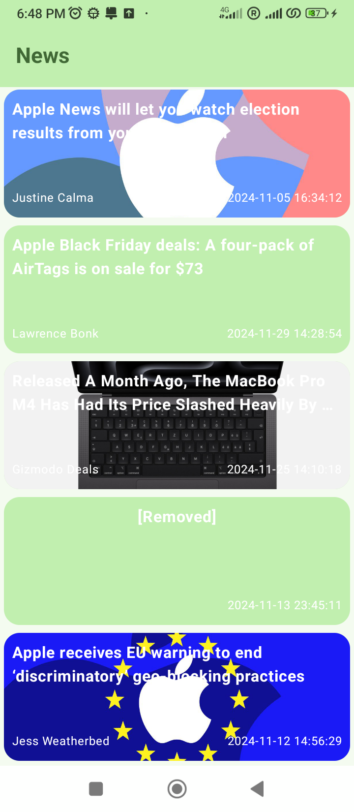
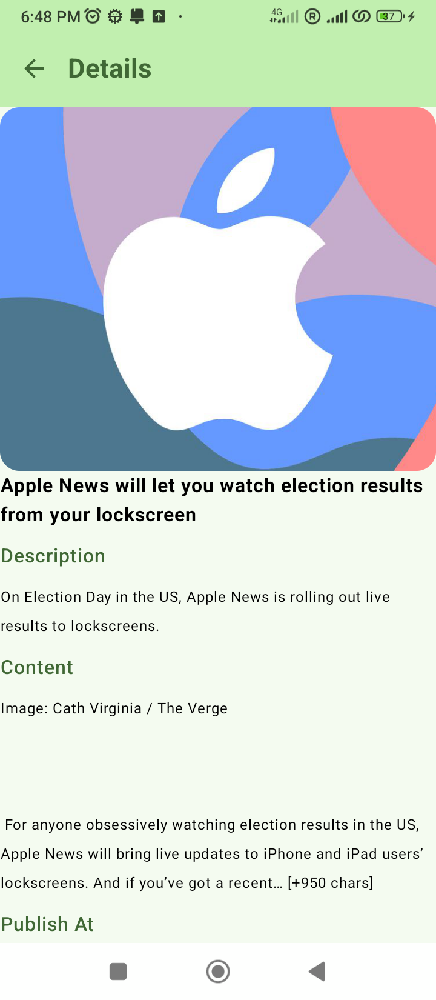

# TechnicalTest
L'application permet d'afficher les actualités

Architecture
---------------
Lorsque vous démarrez le développement d'une application Android.Il est très important de choisir l'architecture du projet.
Pour cela, j'ai choisie l'architecture MVVM et Clean pour car elle a plusieurs avantages comme les composants plus modulaires, facilite la testabilité et factilite la maintenabilité.

---------------
data: (Model).  contient la base de données locale et les API externe

domain: la logique métier du projet est conservée dans cette couche avec les usecases

présentation: Représente l'interface utilisateur (Jetpack compose) et ViewModels. Elle ne contient plus de logique métier, ce qui simplifie son rôle.

di: Injection de dépendances en utilisant Dagger Hilt.

applications : contient la classe d'application

Captures d'écran
-----------

Fonctionnalités de l'application
---------------
* afficher la liste des actualités
* afficher le détails de l'actualité

Bibliothèques utilisées
---------------
* [Kotlin](https://kotlinlang.org/) -langage  
* [Jetpack Compose](https://developer.android.com/develop/ui/compose) - implémentations des écrans
* [ViewModel](https://developer.android.com/topic/libraries/architecture/viewmodel) - stocker et gérer les données liées à l'interface utilisateur en tenant compte du cycle de vie
* [Lifecycle](https://developer.android.com/topic/libraries/architecture/lifecycle) 
* [Material](https://material.io/develop/android/docs/getting-started/) - Material Components.
* [Coroutines](https://kotlinlang.org/docs/reference/coroutines-overview.html) and [Flow](https://developer.android.com/kotlin/flow) pour les tâches asynchrones
* [Retrofit2](https://square.github.io/retrofit/)- consommation des web services
* [Coile](https://coil-kt.github.io/coil/compose/)- afficher les images en utilisant coil
* [Dagger Hilt](https://dagger.dev/hilt/) - injecteur de dépendance
* [Gson](https://github.com/google/gson) - convertir les objets Kotlin en JSON et vice versa
* [Mockito](https://site.mockito.org/) - mockito pour les données fictives
* [Junit](https://junit.org/junit5/) - Junit pour le test unitaires

Choix Technique des Bibliothèques
---------------
* Kotlin : 
J'ai utilisé Koltin pour le développement Android car Koltin est la language Officiel sous Android.
Il réduit la verbosité de Java. Moins de code est nécessaire pour accomplir les mêmes tâches, ce qui améliore la lisibilité et réduit les erreurs.
Kotlin est devenu le langage de choix pour Android car il combine concision, sécurité, modernité et facilité d'utilisation, tout en offrant une compatibilité totale avec l'écosystème Java existant.
Cela en fait un outil idéal pour les développeurs cherchant à créer des applications Android robustes et évolutives.
* Jetpack Compose :
J'ai utilisé cette bibliothèques car il a plusieurs avtanages que l'XML.
Il révolutionne le développement d'UI sous Android en rendant le processus plus simple, rapide, et moderne.
Il s'adapte parfaitement aux besoins des développeurs actuels grâce à sa flexibilité, sa puissance, et son intégration avec l'écosystème Kotlin et Jetpack.
Cela en fait un outil incontournable pour créer des applications Android élégantes et efficaces.
* Retrofit:
J'ai choisie Retrofit car il est la bibliothèques puissante, flexible et convivial qui simplifie la consommation de services web sous Android.
Grâce à sa facilité d'utilisation, son intégration avec Kotlin, son extensibilité et ses performances robustes.
Retrofit est un choix idéal pour gérer les API REST dans les projets Android modernes.
* Coroutines:
Les coroutines simplifient la gestion des tâches asynchrones sous Android en rendant le code plus lisible, maintenable, et performant. 
En intégrant des bibliothèques modernes comme les scopes, Flow, et plus adapté avec Kotlin.
* Coil: 
J'ai choisie cette bibliothèques car il est le choix idéal pour les développeurs Android modernes qui souhaitent une bibliothèque de chargement d'images légère, performante, et parfaitement intégrée avec Kotlin et Jetpack Compose.
Ses fonctionnalités avancées, sa simplicité d'utilisation et son alignement avec les pratiques actuelles en font une alternative incontournable à Glide et Picasso.
* Dagger Hilt :
Dagger Hilt est le choix idéal pour l'injection de dépendances sous Android grâce à sa simplicité, son intégration native avec l'écosystème Android, et son alignement avec les bonnes pratiques modernes.
En rendant l'injection de dépendances intuitive, testable, et modulable, Hilt permet de se concentrer sur la logique métier de leur application plutôt que sur des détails techniques complexes.

Point d'amélioration sur l'application:
---------------
Plusieurs améliorations possible sur l'application :
* Gestion de mode Offline: le mode offline consiste à sauvgarder les données qui sont réçu lors de l'appel des web services pour que l'utilisateur peut le voir lorsque il n'a pas de connexion Internet.
* Recherche Actualité : comme point d'amélioration sur l'application, on peut ajouter une zone de recherche en haut de la liste pour que l'utilisateur peut faire une recherche par titre, contenu, site etc ..
* Gestion des favoris: on peut ajouter une liste des favoris
* Amelioration UI/UX : Ajouter une bottom bar en bas de l'écran pour que l'utilisateur peut voir la liste des actualité, favoris etc ...
* Test Unitaires : les test unitaire que j'ai mis dans l'application ne couvre pas tous les cases on peut ajouter d'autres test unitaire et on peut utilisé sonarQube pour améliorer le couvrement de test unitaires sur le code.
* Test UI : On peut aussi Ajouter les test UI pour voir les navigations sur l'application

les Api utilisés
---------------
https://newsapi.org/v2/everything?q=Apple&language={language}&page={}&pageSize={pageSize}&apiKey={apiKey}

Durée de Test
---------------
7 heures

